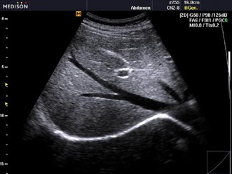
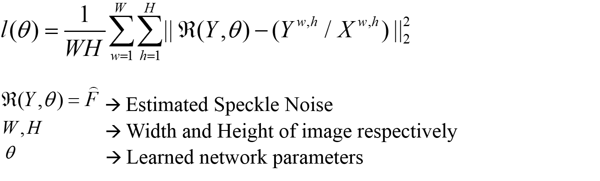
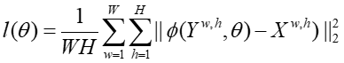
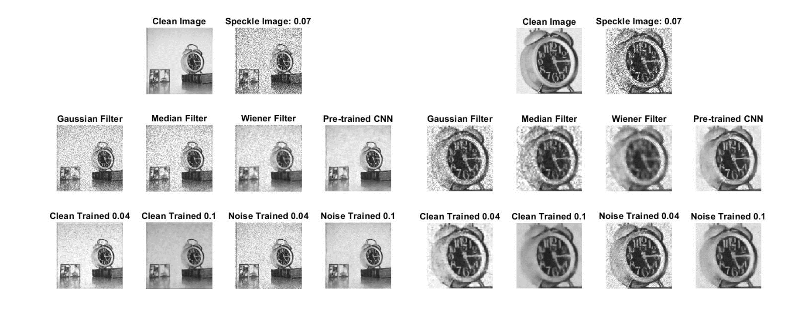

# Image Denoising using a Convolutional Neural Network
## Robert Pohlman, Michael Turney, Rashid Al Mukaddim

## Problem Statement
The project is focused to reduce speckle noise present in B-mode ultrasound (US) imaging. Conventional speckle noise reduction techniques fail to preserve edges and finer details while removing noise. The main aim of the project is to achieve speckle removal from B-mode US images while maintaining edge/sharp features.  Speckle noise in ultrasound images affects edges and fine details that can limit the diagnostic usability. In this project we explore CNN's to perform the neccessary denoising. 

{:class="img-responsive"}

## Current State of the Art
There are number of speckle reduction techniques reported in the peer reviewed literatures. In this work, we categorized the approaches in four groups.
1. Conventional Filtering for Speckle Reduction: These approaches include traditional linear and non-linear filtering techniques. Example includes Gaussian smoothening and median filtering. These methods fail to reliably remove speckle noise due to its signal dependent nature resulting into over smoothed images.
2. Adaptive Filtering: These methods tune filter parameters based local images statistics such as regional mean and variance of intensity. Examples include Lee’s filter [1] , Frost’s filter [2] and Kuan’s filter [3]. Their performance is better compared to conventional techniques due to adaptive nature. But still fails to preserve edges reliably.
3. Partial Differential Equation (PDE) – Based Approaches: These methods control the amount of smoothening based on edge information. The filtering process is formulated as a partial differential equation. Minimizing the solution of this equation over time results into filtered image. They exhibit better edge preserving performance compared to other methods  mentioned here. Example includes - Anisotropic Diffusion filter [4], Total variation minimization scheme [5] and Speckle Reducing Anistopic Diffusion (SRAD) [6] 
4. Neural Network for Image Denoising: In the recent time, neural network based image denoising shown some excellent performance. The of works are cite here [7-9].

## Proposed Solution
We addressed the problem of image despeckling by designing a convolutional neural network. The network structure is motivated be the work by Wang et. al [10].

{:class="img-responsive"}

We are implementing the CNN using MATLAB Neural Network Toolbox (Neural Network Toolbox Release 2018a, The MathWorks, Inc., Natick,     Massachusetts, United States). Our initial goal was to gain some familiarity with the concepts related to designing and training a convolutional neural network in MATLAB. To achieve that goal, we completed the following –  
i.	Experimentation with a pre-trained image de-noising network (pCNN) available from MATLAB [11]  
ii.	Design and train a custom CNN (cCNN) for additive Gaussian noise [10]. (Network was trained using a small dataset of 30 images,   utilizing 512 - 50x50 patches from each image.)  
iii.	Performance comparison among conventional filtering, pre-trained CNN and custom CNN  

After becoming comfortable with CNNs in MATLAB we designed our own network to solve the image despeckling problem. 
### Image Dataset 

The following networks were trained using approximatily 5500 images from the ImageNet Large Scale Visual Recognition Challenge 2017. (ILSVRC2017) 

## Residual Learning Formulation
{:class="img-responsive"}

The input of the proposed image denoising convolutional neural network (CNN) is a noisy image corrupted by multiplicative speckle noise. The input image, Y is modeled as Y = X(1+F) where F is the speckle noise variable and X is the clean ideal image. The goal of our proposed CNN is to learn a mapping from Y F to estimate the underlying speckle noise. In order to achieve this, a residual learning formulation is adopted from [11] is utilized to train the CNN. Formally, the Euclidean loss function for training can be defined: 

{:class="img-responsive"}

where  is the learned network parameters to estimate underlying speckle noise,  . The image dimensions are defined using W and H representing width and height respectively. Finally, despeckled image is generated through a point-wise division operation involving noisy image and estimated noise. Formally, we can express despeckled image as:   where ,/ represents elementwise division between two matrices. 

## Network Architecture
The proposed network architecture is shown in Figure 1. The proposed CNN has a depth of 8 with two types of layers. 
(i) Conv+ReLU: Layers 1 and 8 uses 64 convolutional filters to generated feature maps and rectified linear units (ReLu,  ) for non-linearity. (ii) Conv+BN+ReLU: Layers 2-7 uses convolutional filters with additional batch normalization [11] between filters and ReLu. The detailed specification of the network is presented in Table 1.

{:class="img-responsive"}

## Direct Denoising Formulation
We utilized the similar network architecture discussed in previous section to directly perform denoising of the noisy image. The goal of this CNN is to learn a mapping from Y X to estimate the underlying clean image. Euclidean loss function is used for training defined as:

{:class="img-responsive"}

where,   is the learned network parameters for estimating despeckled image,  . Network configurations are presented in Table 1.

## Results for Additive Noise
We report on the noise removal from images corrupted with Gaussian white noise with varying noise variance. The noisy images were generated using a simple noise model -   where  and   are variance and mean of the noise distribution respectively. (m,n) is defined by the row and column dimensions of the original image. The noisy images are de-noised using Gaussian filter, Median filter, Pre-trained CNN and three custom trained CNNs. The two figures below present qualitative comparisons among the methods. 

{:class="img-responsive"}

The figure above clearly illustrates superior performance of CNN over conventional de-noising filters. Among cCNNs, the one trained with noise variance 0.6 performed the best. cCNN (0.6) is showing comparable performance with pCNN although pCNN did better in preserving small details (refer to the clock ticks). 

{:class="img-responsive"}

The above figure illustrates another case of superior performance of CNN over conventional de-noising filters. Among cCNNs, the one trained with noise variance 0.6 performed the best. In this case, cCNN (0.6) performed better compared to pCNN in recovering the global details of the image. It can be argued that some fine detail is recovered better by pCNN than cCNN (0.6). 
The examples show that the CNNs have trade-offs between recovering global and finer details. This qualitative observation leads us to one of our main future goal for this project – “Recovering global and finer details from the noisy image using our custom designed network”.  
For quantitative performance evaluation, we looked into three different image quality metrics – a) Peak SNR (pSNR) b) Mean Squared Error (MSE) and c) Structural Similarity Index (SSIM) [12]. The metrics are defined as follows –

In the above equations,   are mean squared error, local means, standard deviations and cross-covariance for images x and y respectively. The image quality indices are evaluated over a range of noise variance to comparing the performance between pre-trained and custom trained CNN. 

{:class="img-responsive"}

The quantitative plots show similar results to the qualitative results shown in the above figures. We can see that the pCNN performs better for lower image noise levels (0-0.12) than all of the cCNNs. However, when reaching higher noise levels, the cCNNs trained with higher noise levels perform better than the pCNN. We do want to add caution, even if the quantitative measurements show better results, qualitative results are needed to see key features and finer details such as the clock hands in the above figures.

## Results for Multiplicative Noise
We also report on the noise removal from images corrupted with multiplicative noise taken from a uniform noise distribution with zero mean and a range of noise variance. The noisy images were generated with the below noise model. The noisy images are denoised using two different custom trained CNN's shown below. 

{:class="img-responsive"}

The figures above illustrate the performance differences in the respective each networks. Visually, the best denoised image comes from the network which was trained for a noise image with the division layer. 

{:class="img-responsive"}
These quantitative plots show numerically how the different methods perform. We can see again the pCNN performs better until the noise levels approach the level that was used for the training process. In that case, the respective networks perform best at each noise level. Of the two custom networks that were trained, the network that was trained for a noise residual (instead of a clean image) performed better. 

### References
[1] J. S. Lee, IEEE Trans. Pattern Anal. Mach. Intell., 1980
[2] V. Frost, J. Stiles, K. Shanmugan, and J. Holtzman, IEEE Trans. Pattern Anal. Mach. Intell.,1982 
[3] D. Kuan, A. Sawchuck, T. Strand, and P. Chavel, IEEE Trans. Pattern Anal. Mach. Intell.,1985 
[4] P. Perona and J. Malik, IEEE Trans. Pattern Anal. Mach. Intell., 1990 
[5] L. Rudin, S. Osher, and E. Fatemi, Phys. D, 1992 
[6] Y. Yu and S. T. Acton, IEEE Trans. Image Process, 2002. 
[7] Jain, Viren, and Sebastian Seung. Advances in Neural Information Processing Systems. 2009.
[8] Zhang, Kai, et al. IEEE Transactions on Image Processing 26.7 (2017): 3142-3155.
[9] Haque, Kazi Nazmul, Mohammad Abu Yousuf, and Rajib Rana. arXiv preprint arXiv:1801.05141 (2018
[10]	P. Wang, H. Zhang, and V. M. Patel, "SAR Image Despeckling Using a Convolutional," arXiv preprint arXiv:1706.00552, 2017.  
[11]	K. Zhang, W. Zuo, Y. Chen, D. Meng, and L. Zhang, "Beyond a Gaussian Denoiser: Residual Learning of Deep CNN for Image Denoising,"   IEEE Trans Image Process, vol. 26, no. 7, pp. 3142-3155, Jul 2017.  
[12]	Z. Wang, A. C. Bovik, H. R. Sheikh, and E. P. Simoncelli, "Image quality assessment: from error visibility to structural similarity,"  IEEE transactions on image processing, vol. 13, no. 4, pp. 600-612, 2004.
