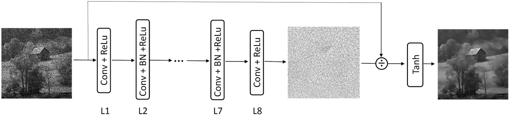
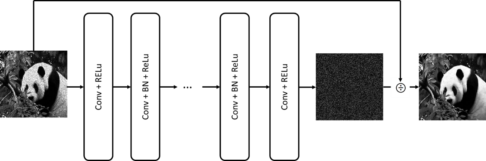
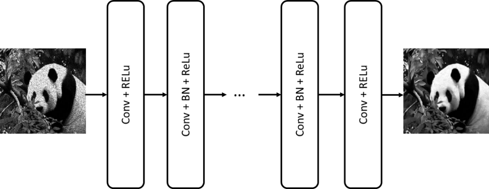
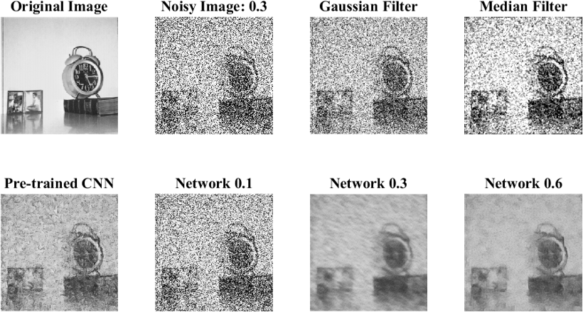
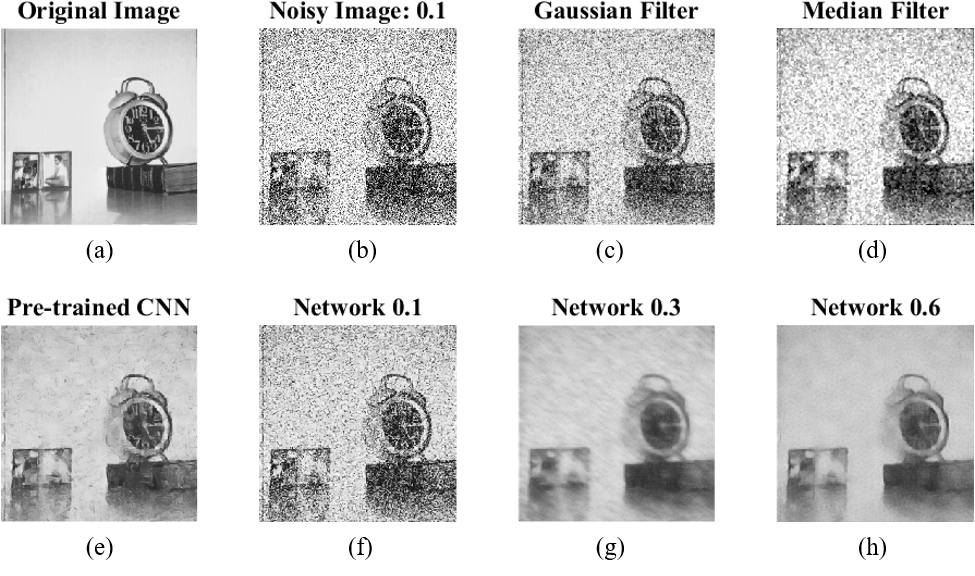
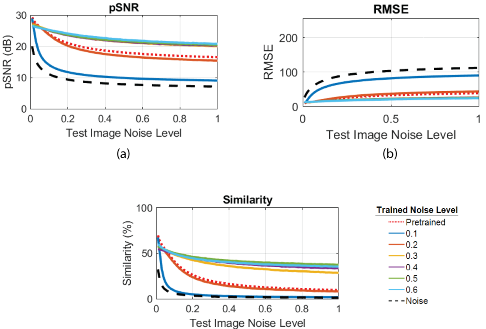
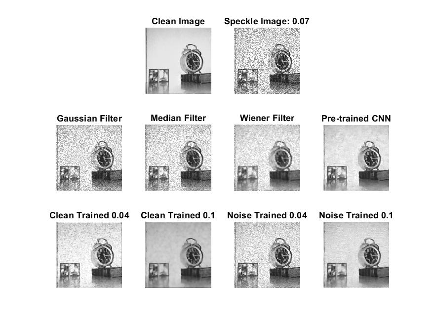
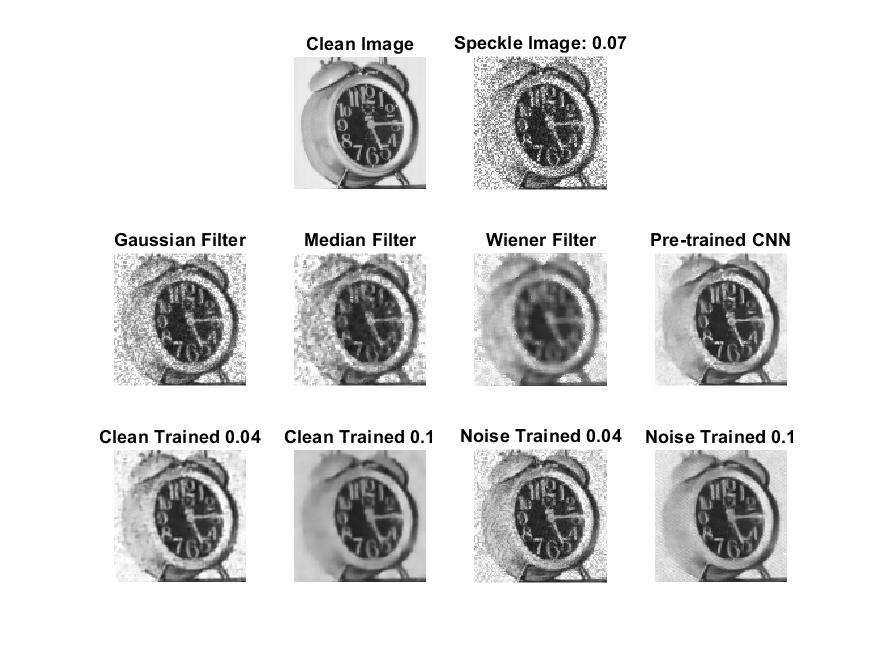
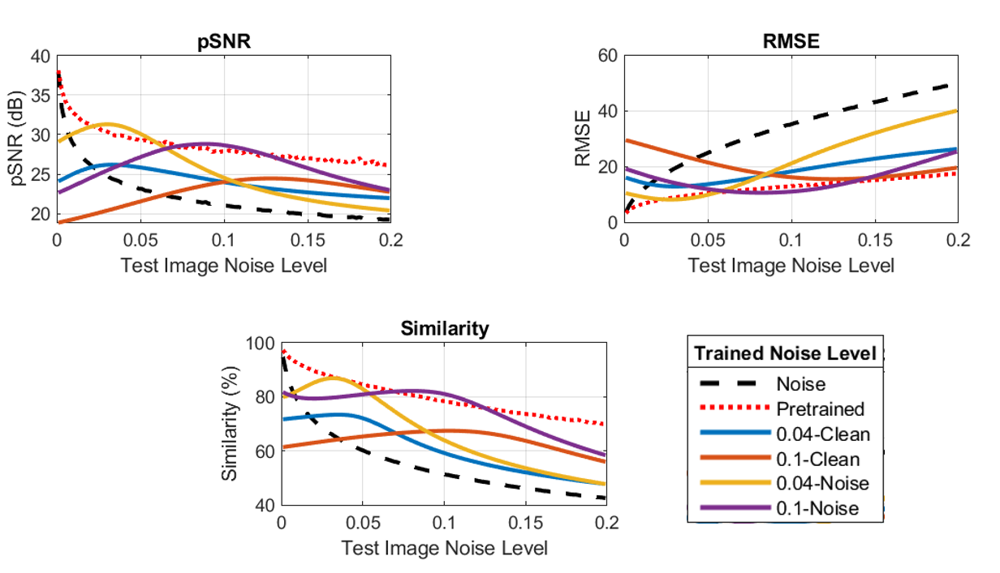

[flowchart1]: Images/Picture1.png
[flowchart2]: https://github.com/mturney2/CS-766-CNN-Image-Despeckling-/blob/master/Images/Picture5.png
[flowchart3]: https://github.com/mturney2/CS-766-CNN-Image-Despeckling-/blob/master/Images/Picture6.png
[multiplicative1]: https://github.com/mturney2/CS-766-CNN-Image-Despeckling-/blob/master/Images/clock/07_Speckle_Clock.jpg
[multiplicative1_zoomed]: https://github.com/mturney2/CS-766-CNN-Image-Despeckling-/blob/master/Images/clock/07_Speckle_Clock_Faces.jpg
[additive1]: https://github.com/mturney2/CS-766-CNN-Image-Despeckling-/blob/master/Images/Picture2.png
[additive2]: https://github.com/mturney2/CS-766-CNN-Image-Despeckling-/blob/master/Images/Picture3.png
[additive_plot]: https://github.com/mturney2/CS-766-CNN-Image-Despeckling-/blob/master/Images/Picture4.png
[multiplicative_plot]: https://github.com/mturney2/CS-766-CNN-Image-Despeckling-/blob/master/Images/Picture7.png

# Image Denoising using a Convolutional Neural Network
## Rashid Al Mukaddim, Michael Turney, Robert Pohlman

## Problem Statement
The project is focused to reduce speckle noise present in B-mode ultrasound (US) imaging. Conventional speckle noise reduction techniques fail to preserve edges and finer details while removing noise. The main aim of the project is to achieve speckle removal from B-mode US images while maintaining edge/sharp features.  

## Current State of the Art

## Proposed Solution
We are attempting to address the problem by designing an image despeckling convolutional neural network. The network structure is motivated be the work by Wang et. al [1].

{:class="img-responsive"}

## Implementation Details

### Network Description
### Residual Learning Formulation
{:class="img-responsive"}

### Network Architecture

### Direct Denoising Formulation
{:class="img-responsive"}

## Results for Additive Noise
We are implementing the CNN using MATLAB Neural Network Toolbox (Neural Network Toolbox Release 2018a, The MathWorks, Inc., Natick,     Massachusetts, United States). Our main goal for mid-term progress was to gain familiarity with the concepts related to designing and   training a convolutional neural network in MATLAB. To achieve that goal, we have done the following –  
i.	Experimentation with a pre-trained image de-noising network (pCNN) available from MATLAB [2]  
ii.	Design and train a custom CNN (cCNN) for additive Gaussian noise [1]. (Network was trained using a small dataset of 30 images,   utilizing 512 - 50x50 patches from each image.)  
iii.	Performance comparison among conventional filtering, pre-trained CNN and custom CNN  

We report on the noise removal from images corrupted with Gaussian white noise. The noisy images were generated using a simple noise model -   where  and   are variance and mean of the noise distribution respectively. (m,n) is defined by the row and column dimensions of the original image. The noisy images are de-noised using Gaussian filter, Median filter, Pre-trained CNN and three custom trained CNNs. Figure 1 and 2 present qualitative comparisons among the methods. 

{:class="img-responsive"}

The figure above clearly illustrates superior performance of CNN over conventional de-noising filters. Among cCNNs, the one trained with noise variance 0.6 performed the best. cCNN (0.6) is showing comparable performance with pCNN although pCNN did better in preserving small details (refer to the clock ticks). 

{:class="img-responsive"}

The above figure illustrates another case of superior performance of CNN over conventional de-noising filters. Among cCNNs, the one trained with noise variance 0.6 performed the best. In this case, cCNN (0.6) performed better compared to pCNN in recovering the global details of the image. It can be argued that some fine detail is recovered better by pCNN than cCNN (0.6). 
The examples show that the CNNs have trade-offs between recovering global and finer details. This qualitative observation leads us to one of our main future goal for this project – “Recovering global and finer details from the noisy image using our custom designed network”.  
For quantitative performance evaluation, we looked into three different image quality metrics – a) Peak SNR (pSNR) b) Mean Squared Error (MSE) and c) Structural Similarity Index (SSIM) [3]. The metrics are defined as follows –

In the above equations,   are mean squared error, local means, standard deviations and cross-covariance for images x and y respectively. The image quality indices are evaluated over a range of noise variance to comparing the performance between pre-trained and custom trained CNN. 

{:class="img-responsive"}

The quantitative plots show similar results to the qualitative results shown in the above figures. We can see that the pCNN performs better for lower image noise levels (0-0.12) than all of the cCNNs. However, when reaching higher noise levels, the cCNNs trained with higher noise levels perform better than the pCNN. We do want to add caution, even if the quantitative measurements show better results, qualitative results are needed to see key features and finer details such as the clock hands in the above figures.

## Results for Multiplicative Noise

{:class="img-responsive"}

{:class="img-responsive"}

{:class="img-responsive"}

### References
[1]	P. Wang, H. Zhang, and V. M. Patel, "SAR Image Despeckling Using a Convolutional," arXiv preprint arXiv:1706.00552, 2017.  
[2]	K. Zhang, W. Zuo, Y. Chen, D. Meng, and L. Zhang, "Beyond a Gaussian Denoiser: Residual Learning of Deep CNN for Image Denoising,"   IEEE Trans Image Process, vol. 26, no. 7, pp. 3142-3155, Jul 2017.  
[3]	Z. Wang, A. C. Bovik, H. R. Sheikh, and E. P. Simoncelli, "Image quality assessment: from error visibility to structural similarity,"  IEEE transactions on image processing, vol. 13, no. 4, pp. 600-612, 2004.
